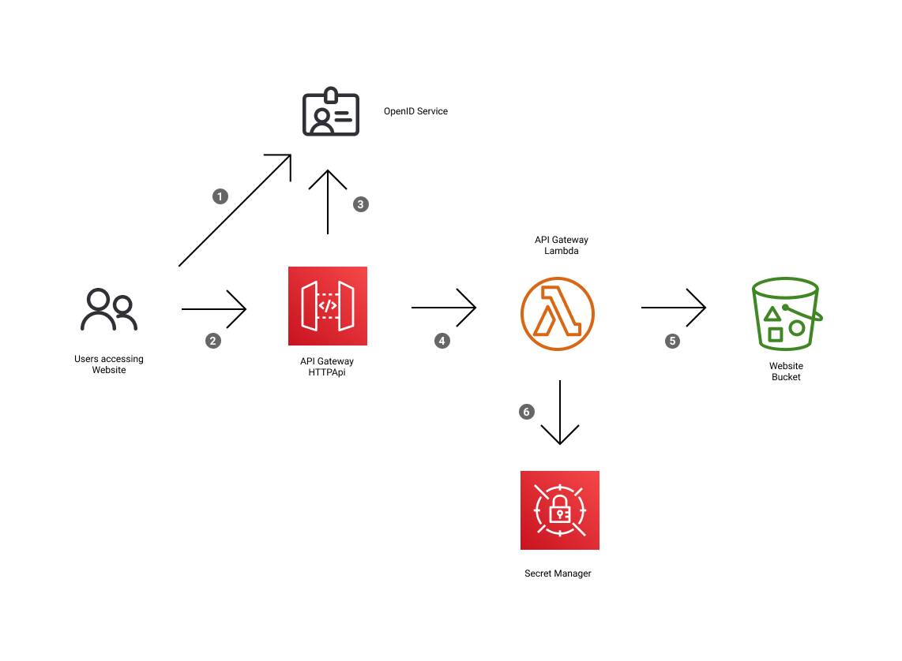

# s3website-openid-proxy

This service provides [OpenID](https://openid.net/) authenticated access to a static website hosted in an s3 bucket.  

It is designed to be a simple way to add authentication to [static websites](https://en.wikipedia.org/wiki/Static_web_page) stored in [AWS S3](https://aws.amazon.com/s3/).

This service uses [AWS API Gateway](https://aws.amazon.com/api-gateway/) HTTP APIs and is powered by [AWS Lambda](https://aws.amazon.com/lambda/).

# How it works



1. Each request to the site checks for a session cookie prior to returning a response. If a user accesses the site for the first time users they are redirected to the OpenID provider.
2. User authenticates with the OpenID provider and is redirected back to the website as per the [OAuth 2.0 Authorization Code Grant Type](https://developer.okta.com/blog/2018/04/10/oauth-authorization-code-grant-type#what-is-an-oauth-20-grant-type).
3. After authentication occurs the users info is retrieved, this includes `sub` and `email`, both of these are saved to the users session and logged when accessing content.
4. Uses the API Gateway version 2 format which includes support for cookies, this is translated to normal HTTP requests using [apex/gateway](https://github.com/apex/gateway).
5. GET requests are translated into GetObject requests which retrieve objects from the S3 bucket using [wolfeidau/echo-s3-middleware](https://github.com/wolfeidau/echo-s3-middleware). All these requests pass through the service.
6. The secret used to sign session cookies is stored in [AWS Secrets Manager](https://aws.amazon.com/secrets-manager/).

## Cookies

This service uses two cookies to manage state, these are both signed using [gorilla/securecookie](https://github.com/gorilla/securecookie) with a secret generated by AWS Secrets Manager. Both cookies are also marked as `secure` and `httpOnly` in line with best practices.

For reference these cookies are:

* `proxy_auth_session` is used to store the oauth2 state variable during authentication and has an expiry of 5 minutes.
* `proxy_login_session` is used to check your logged in during the life of your session, this has an expiry of 8 hours.

# Goals

1. Provide a simple authentication access to static websites hosted in s3.
2. Utilise AWS lambda and API Gateway to enable low cost hosting.
3. Take advantage of the rate limiting provided by AWS API Gateway to ensure access isn't possible using [brute force attacks](https://en.wikipedia.org/wiki/Brute-force_attack).
4. Use existing opensource libraries to provide secure access via cookies.
5. Support OpenID authentication of users accessing the site.
# Deployment

You will need the following tools.

* [AWS cli](https://aws.amazon.com/cli/) 
* [SAM cli](https://github.com/aws/aws-sam-cli)

Also an aws profile setup with your [aws credentials](https://docs.aws.amazon.com/cli/latest/userguide/cli-configure-files.html).

Create an OpenID application in a service such as [Okta](https://www.okta.com/).

Create an .envrc file using [direnv](https://direnv.net/).

```bash
#!/bin/bash

export AWS_PROFILE=wolfeidau
export AWS_DEFAULT_PROFILE=wolfeidau
export AWS_REGION=ap-southeast-2

# these are provided by your OpenID provider 
export CLIENT_ID=xxxxxxxxx
export CLIENT_SECRET=xxxxxxxxx
export ISSUER=https://dev-xxxxxx.okta.com

export HOSTED_ZONE_ID=XXXXXXXXXX

# results in $SUBDOMAIN_NAME.$HOSTED_ZONE_NAME or something.wolfe.id.au
export HOSTED_ZONE_NAME=wolfe.id.au
export SUBDOMAIN_NAME=something
```

Run make.

```
make
```

# TODO

* [ ] Add support for [PKCE](https://oauth.net/2/pkce/)
* [ ] Add an example using [AWS Cognito](https://aws.amazon.com/cognito/) via OpenID.
* [ ] Add an example with [Amazon Cloudfront](https://aws.amazon.com/cloudfront/) in front of the API Gateway supporting the use of [AWS WAF](https://aws.amazon.com/waf/) to enable IP whitelisting and other [AWS managed rule sets](https://docs.aws.amazon.com/waf/latest/developerguide/aws-managed-rule-groups-list.html) for compliance. 
* [ ] Provide some options to configure what cache headers for single page applications which already use [cache busting](https://www.keycdn.com/support/what-is-cache-busting) for their assets.
* [ ] Containerise this service to enable running in [AWS fargate](https://aws.amazon.com/fargate/) or possibly [kubernetes](https://kubernetes.io/).

# License

This application is released under Apache 2.0 license and is copyright [Mark Wolfe](https://www.wolfe.id.au).
